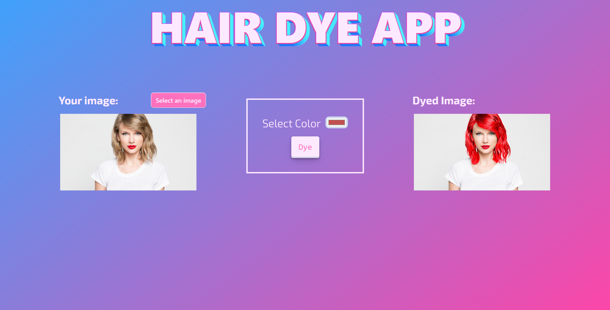

<p align="center">
  <a href="https://www.uit.edu.vn/" title="Trường Đại học Công nghệ Thông tin" style="border: none;">
    
  </a>
</p>

# Virtual Hair Dye Try-on Application



## Overview

This is final project for Computational Thinking course at UIT - CS117.N21.KHTN

### Usage

This application allows you to try out different hair colors.

* Upload a portrait image of yourself
* Choose a color 
* Press 'Dye'

**Notes**: This application may not function correctly if you upload an image that includes animals, multiple people, or individuals without hair.


### Course info
* **Course Name**: Computational Thinking
* **Course Code**: CS117
* **Class**: CS117.N21.KHTN
* **Academic Year**: 2022-2023
* **Lecturer**: Dr. Ngo Duc Thanh
### Member
| **Id**   | **Student ID** |**Name**| **Github**| **Email** |
| ------ |-------------| ----------------------|-----------------------------------------------------|-------------------------
| 1      | 21520069      | Võ Trần Thu Ngân|https://github.com/nganngants|21520069@gm.uit.edu.vn   |
| 2      | 21520474      | Lê Hoài Thương|https://github.com/Chirox03|21520474@gm.uit.edu.vn   |
| 3      | 21522034      | Nguyễn Hoàng Hải|https://github.com/SKN443 |21522034@gm.uit.edu.vn   |
| 4      | 21522282      | Lê Thị Liên |https://github.com/lltlien  |21522282@gm.uit.edu.vn   |
| 5      | 21522407      | Phan Trọng Nhân | https://github.com/PTN407 |21522407@gm.uit.edu.vn   |

## Project

### Run project
Run both backend and frontend:

#### Frontend:

* Make sure to install all packages first:
    ```
    cd frontend
    npm install
    ```

* Run frontend:
    ```
    npm start
    ```

#### Backend:
* Create virtual environment:
    ```
    cd backend
    py -m venv env
    env\Scripts\activate
    ```
* Make sure to install all packages in the virtual enviroment:

    ```
    pip install -r requirements.txt
    ```
* Run backend:
    ```
    py app.py
    ```
Open [http://localhost:3000](http://localhost:3000) to view the application on your browser
